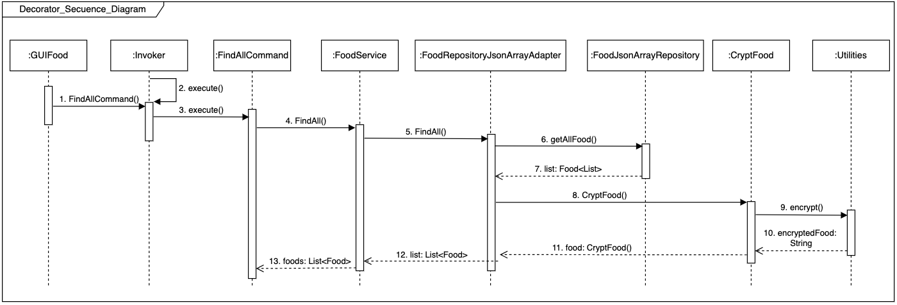

## Descripción

Taller 5 - Patrón Adapter y Patrón Decorator. Este es un proyecto Java with Maven que contiene pruebas unitarias y fue desarrollado con el fin 
de conocer y aplicar los patrones en mención para el diseño de sistemas software flexibles y mantenibles.

## Diagramas de Secuencia

- Patrón Adapter

- Patrón Decorator

## Ejecutar el programa principal

Mediante la CLI y haciendo uso de Maven:

- Limpiar, construir y compilar el proyecto

` mvn clean install package `

- Luego:

`mvn exec:java -Dexec.mainClass='co.edu.unicauca.commandrestaurant.presentation.GUIFood'`

## Correr las pruebas unitarias

`mvn test`

