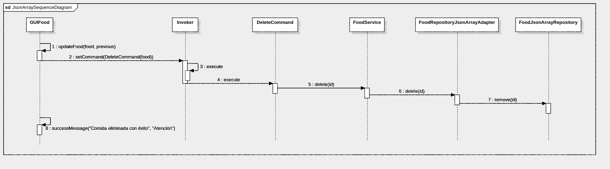
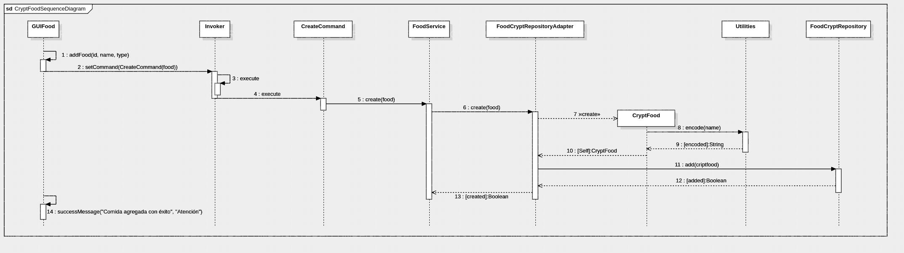

# Práctica - Adapter pattern y Decorator pattern

El proyecto fue creado usando [maven](https://maven.apache.org/), asegúrese de tenerlo previamente instalado.

## Diagramas de secuencia

### Digramas de secuencia DeleteCommand usando JsonArray

Con este diagrama de secuencia se espera ejemplificar el uso de JsonArray empleando el Adapter Pattern cuando el usuario ejecuta el DeleteCommand.

### Diagrama de secuencia CreateCommand para CryptFood

Con este diagrama de secuencia se desea mostrar un ejemplo del uso del Decorator pattern en CyptoFood usando conjuntamente el Adapter Pattern cuando el usuario ejecuta el CreateCommand.

## Usabilidad

Estando en el directorio raiz del proyecto, ejecutar el comando: 

~~~sh
mvn clean install package
~~~

Y posteriormente para correr la solución usar:

~~~zsh
java -cp ./target/DecoratorAdapterRestaurant.jar 'co.edu.unicauca.commandrestaurant.presentation.GUIFood'
~~~
